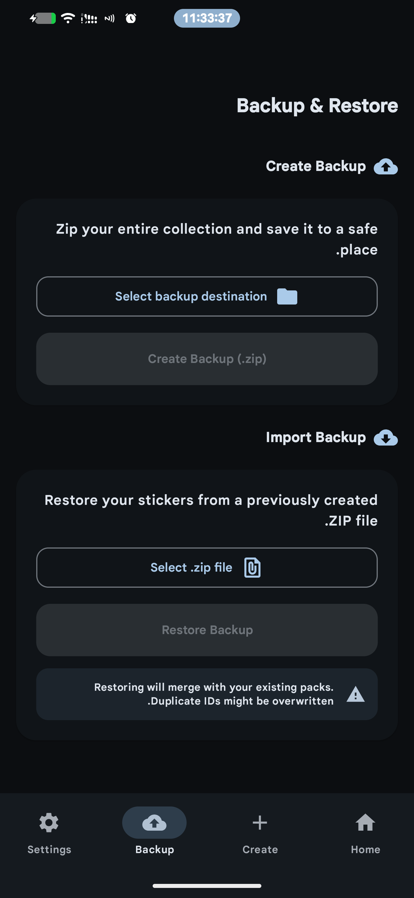
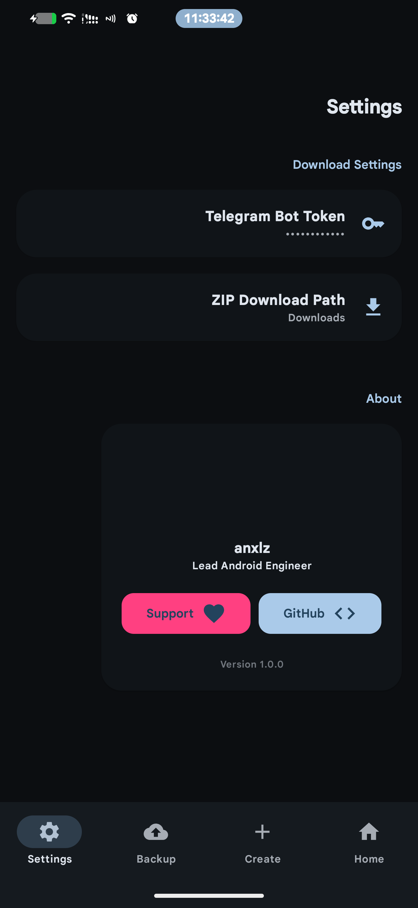
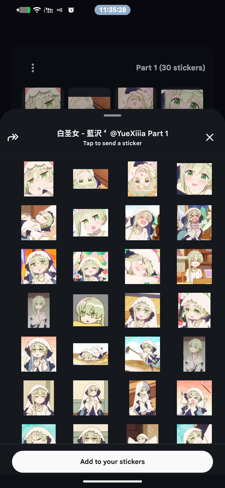
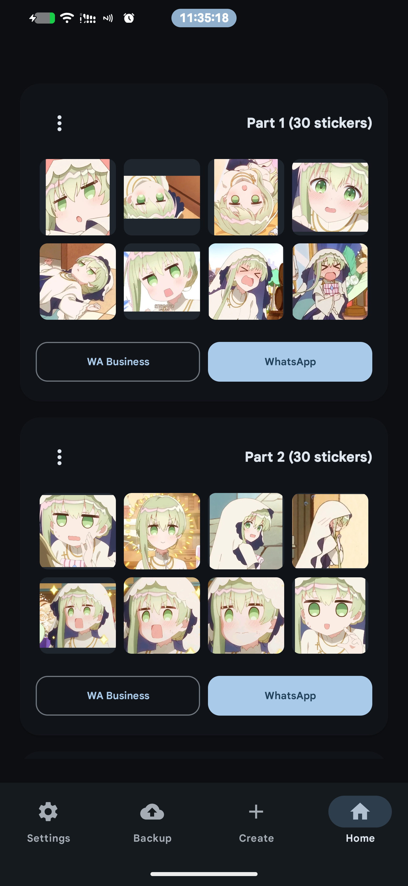
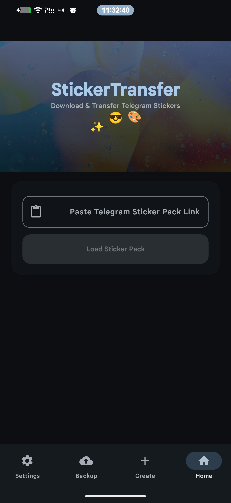

<div align="center">


# StickerTransfer

**Transfer Telegram sticker packs directly to WhatsApp — no PC required.**

[](https://github.com/anxlz/StickerTransfer/releases/latest)
[](https://github.com/anxlz/StickerTransfer/releases/latest)
[](https://github.com/anxlz/StickerTransfer/blob/main/LICENSE)
[](https://github.com/anxlz/StickerTransfer/stargazers)

[**Download APK**](https://github.com/anxlz/StickerTransfer/releases/latest) • [**Report Bug**](https://github.com/anxlz/StickerTransfer/issues) • [**Request Feature**](https://github.com/anxlz/StickerTransfer/issues)

</div>

---

## Features

- 🔽 **Telegram Download** — Paste any `t.me/addstickers/` link to download up to 120 stickers
- 💬 **WhatsApp Integration** — Add packs directly to WhatsApp or WhatsApp Business
- ✂️ **Auto Split** — Packs are automatically split into parts of 30 stickers (WhatsApp limit)
- 📦 **ZIP Export** — Export any pack as a `.zip` file to your Downloads folder
- 📥 **ZIP Import** — Import your own 512×512 WEBP sticker packs
- 🎨 **Material You** — Dynamic color theming with full dark/light mode support
- 🔒 **Privacy First** — Bot token stored locally, no data sent anywhere except Telegram API

---

## Screenshots

<div align="center">





</div>

---

## Download

<div align="center">

[](https://github.com/anxlz/StickerTransfer/releases/latest)

</div>

> **Note:** Enable *Install unknown apps* in your Android settings before installing.

---

## Requirements

| Requirement | Version |
|---|---|
| Android | 7.0+ (API 24) |
| WhatsApp | 2.19.51+ |
| Telegram Bot Token | Free — from [@BotFather](https://t.me/BotFather) |

---

## Setup

1. Install the APK from [Releases](https://github.com/anxlz/StickerTransfer/releases/latest)
2. Open the app → tap **⚙️ Settings** (top-right)
3. Enter your Telegram Bot Token from [@BotFather](https://t.me/BotFather)
4. Paste any sticker pack link and tap **Load**

**Example links to try:**
```
https://t.me/addstickers/Animals
https://t.me/addstickers/HotCherry
```

---

## How It Works

```
Paste t.me/addstickers/PackName
        ↓
Fetch metadata via Telegram Bot API
        ↓
Download & convert to 512×512 WEBP
        ↓
Split into parts (max 30 stickers each)
        ↓
Add to WhatsApp via StickerContentProvider
```

---

## Build From Source

```bash
# Clone the repository
git clone https://github.com/anxlz/StickerTransfer.git
cd StickerTransfer

# Build debug APK
./gradlew assembleDebug

# APK output
app/build/outputs/apk/debug/app-debug.apk
```

**Requirements:** Android Studio Hedgehog+, JDK 17, Android SDK 34

---

## Tech Stack

| Layer | Technology |
|---|---|
| Language | Kotlin |
| UI | Jetpack Compose + Material You (MD3) |
| Architecture | MVVM + Repository + StateFlow |
| HTTP Client | Ktor |
| Image Loading | Coil |
| Storage | DataStore Preferences |
| Build | Gradle Kotlin DSL |

---

## Contributing

Pull requests are welcome! For major changes, please open an issue first to discuss what you would like to change.

---

## Support

<div align="center">

If you find this project useful, consider supporting its development:

[](https://github.com/sponsors/anxlz)

⭐ **Starring the repo is also a great way to show support!**

</div>

---

## License

```
MIT License — Copyright (c) 2024 anxlz
```

See [LICENSE](LICENSE) for full details.

---

<div align="center">
Made with ❤️ by <a href="https://github.com/anxlz">anxlz</a>
</div>
